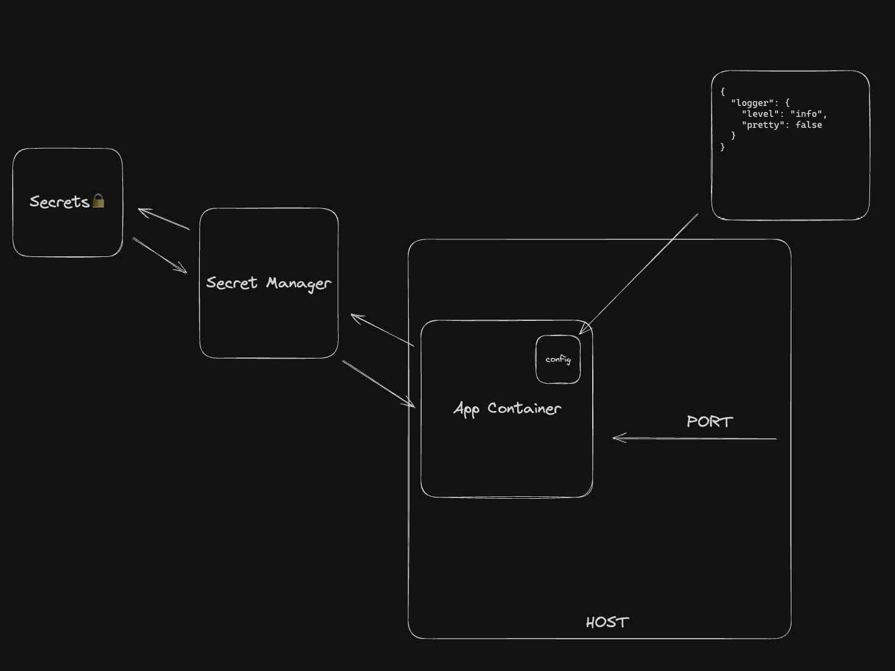

# Config loader

The following is a concept of the config loader.

I think the application has 3 types of configurations:

- Env variables - different for every environment | changes frequently (PORT, Config path)
- Secrets - sensitive information
- Config - non-sensitive information

App doesn't know anything about the outside world. Everything is passed via the config and that's the only state the app
knows about.

DON'T ❌

```js
const config = `config.${process.env.NODE_ENV}.json5`;

if (NODE_ENV === "test") {
// do something
} else {
// do something else
}
```

DO ✅

```js
const config = await fs.promises.readFile(env.APP_CONFIG);

if (config.service.enabled) {
// do something
} else {
// do something else
}
```

```shell
APP_CONFIG=config.json5 node ./server.js
```



## CommonJS sync loader

As commonjs modules are synchronous, we can't use a top-level await to load the config from the secret manager. We need
to use a sync loader.
The hacky way is to use `execSync` function from `node:child_process` module and execute a promise in a child process.
After that, we can read the stdout and parse the config.

For the ESM modules, we can use a top-level await.

## Files

- `app-config.json5` - config file with non-sensitive information
- `secrets.json5` - config file with sensitive information for the local development (SHOULD NOT BE COMMITTED IN THE REAL-WORLD APP)
- `.env` - env variables (SHOULD NOT BE COMMITTED IN THE REAL-WORLD APP)
